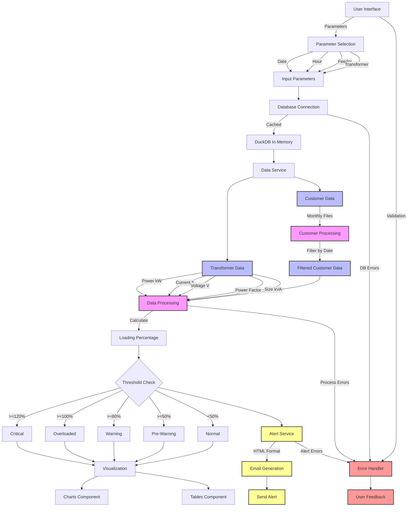

```mermaid
graph TD
    %% User Input Section
    UI[User Interface] --> |Parameters| Params[Parameter Selection]
    Params --> |Date| InputParams[Input Parameters]
    Params --> |Hour| InputParams
    Params --> |Feeder| InputParams
    Params --> |Transformer| InputParams

    %% Database Connection
    InputParams --> DB[Database Connection]
    DB --> |Cached| DuckDB[DuckDB In-Memory]
    
    %% Data Services
    DuckDB --> DataService[Data Service]
    DataService --> TransformerData[Transformer Data]
    DataService --> CustomerData[Customer Data]
    
    %% Transformer Data Flow
    TransformerData --> |Power kW| Processing[Data Processing]
    TransformerData --> |Current A| Processing
    TransformerData --> |Voltage V| Processing
    TransformerData --> |Power Factor| Processing
    TransformerData --> |Size kVA| Processing
    
    %% Customer Data Flow
    CustomerData --> |Monthly Files| CustProcess[Customer Processing]
    CustProcess --> |Filter by Date| FilteredCust[Filtered Customer Data]
    FilteredCust --> Processing
    
    %% Processing and Analysis
    Processing --> |Calculate| LoadingCalc[Loading Percentage]
    LoadingCalc --> ThresholdCheck{Threshold Check}
    ThresholdCheck --> |>=120%| Critical[Critical]
    ThresholdCheck --> |>=100%| Overloaded[Overloaded]
    ThresholdCheck --> |>=80%| Warning[Warning]
    ThresholdCheck --> |>=50%| PreWarning[Pre-Warning]
    ThresholdCheck --> |<50%| Normal[Normal]
    
    %% Visualization
    Critical --> Viz[Visualization]
    Overloaded --> Viz
    Warning --> Viz
    PreWarning --> Viz
    Normal --> Viz
    
    Viz --> Charts[Charts Component]
    Viz --> Tables[Tables Component]
    
    %% Alert System
    ThresholdCheck --> AlertService[Alert Service]
    AlertService --> |HTML Format| EmailGen[Email Generation]
    EmailGen --> EmailSend[Send Alert]
    
    %% Error Handling
    UI --> |Validation| ErrorHandler[Error Handler]
    DB --> |DB Errors| ErrorHandler
    Processing --> |Process Errors| ErrorHandler
    AlertService --> |Alert Errors| ErrorHandler
    ErrorHandler --> UserFeedback[User Feedback]

    %% Styling
    classDef process fill:#f9f,stroke:#333,stroke-width:2px
    classDef data fill:#bbf,stroke:#333,stroke-width:2px
    classDef alert fill:#ff9,stroke:#333,stroke-width:2px
    classDef error fill:#f99,stroke:#333,stroke-width:2px
    
    class Processing,CustProcess process
    class TransformerData,CustomerData,FilteredCust data
    class AlertService,EmailGen,EmailSend alert
    class ErrorHandler,UserFeedback error
```
