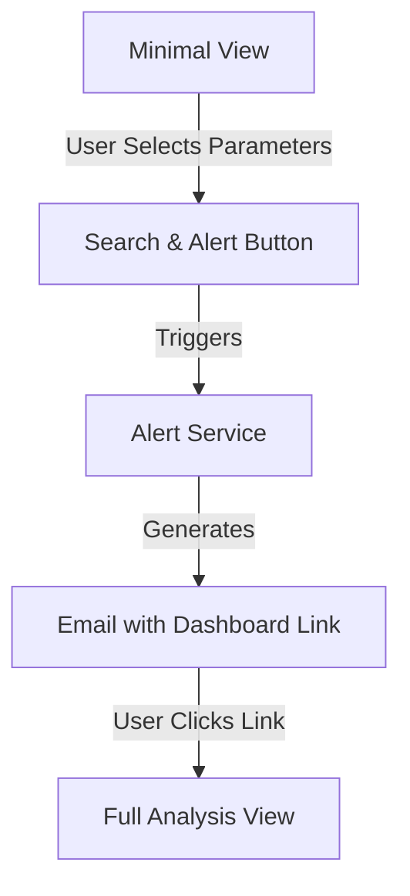

# Transformer Loading Analysis System Architecture

## System Organization

The application is organized into a modular structure while maintaining all original functionality:

```
modularized_app4/
├── app/
    ├── __init__.py
    ├── main.py              # Main application logic
    ├── config/
    │   ├── __init__.py
    │   └── constants.py     # Constants and configurations
    ├── core/
    │   ├── __init__.py
    │   └── database.py      # Database connection handling
    ├── services/
    │   ├── __init__.py
    │   ├── data_service.py  # Data retrieval and processing
    │   └── alert_service.py # Email and alert functionality
    └── visualization/
        ├── __init__.py
        ├── charts.py        # Chart visualization components
        └── tables.py        # Table display components
```

## 1. Initial Search Interface

The system retains its original search criteria interface in `main.py`, allowing users to precisely define their analysis scope:

```python
def main():
    """Main application function"""
    # Sidebar for parameters
    with st.sidebar:
        st.header("Analysis Parameters")
        
        # Date selection
        selected_date = st.date_input(
            "Select Date",
            value=datetime.date.today() - timedelta(days=1)
        )
        
        # Hour selection
        selected_hour = st.selectbox(
            "Select Hour",
            range(24),
            format_func=lambda x: f"{x:02d}:00"
        )
        
        # Feeder selection
        selected_feeder = st.selectbox(
            "Select Feeder",
            ["Feeder 1", "Feeder 2", "Feeder 3", "Feeder 4"]
        )
        
        # Get transformer options for selected feeder
        transformer_options = get_transformer_ids_for_feeder(selected_feeder)
        selected_transformer = st.selectbox(
            "Select Transformer",
            transformer_options if transformer_options else ["No transformers available"]
        )
```

## 2. Core Components

### 2.1 Database Management (`core/database.py`)
Handles all database connections and query suppression:

```python
@st.cache_resource
def get_database_connection():
    """Get a cached DuckDB connection"""
    con = duckdb.connect(database=':memory:', read_only=False)
    con.execute("SET enable_progress_bar=false")
    con.execute("SET errors_as_json=true")
    return con
```

### 2.2 Data Services (`services/data_service.py`)
Manages data retrieval and processing, including transformer and customer data:

#### 2.2.1 Transformer Analysis Data
```python
def get_analysis_results(con, selected_feeder, start_date, end_date, base_path):
    """Get analysis results for the selected feeder and date range"""
    file_query = get_relevant_files_query(base_path, selected_feeder, start_date, end_date)
    if not file_query:
        return pd.DataFrame()

    query = f"""
    SELECT 
        timestamp,
        transformer_id,
        power_kw,
        current_a,
        voltage_v,
        power_factor,
        size_kva,
        (power_kw / NULLIF(size_kva * power_factor, 0)) * 100 AS loading_percentage,
        CASE
            WHEN (power_kw / NULLIF(size_kva * power_factor, 0)) * 100 >= 120 THEN 'Critical'
            WHEN (power_kw / NULLIF(size_kva * power_factor, 0)) * 100 >= 100 THEN 'Overloaded'
            WHEN (power_kw / NULLIF(size_kva * power_factor, 0)) * 100 >= 80 THEN 'Warning'
            WHEN (power_kw / NULLIF(size_kva * power_factor, 0)) * 100 >= 50 THEN 'Pre-Warning'
            ELSE 'Normal'
        END as load_range
    FROM {file_query}
    WHERE timestamp >= '{start_ts}'
    AND timestamp < '{end_ts}'
    ORDER BY timestamp
    """
```

#### 2.2.2 Customer Data Management
Handles customer data retrieval and processing with the following structure:

1. **Data Organization**
   ```
   customer_analysis/
   └── hourly/
       ├── feeder1/
       │   ├── S1F1ATF001_2024-01.parquet  # Monthly customer data files
       │   ├── S1F1ATF001_2024-02.parquet
       │   └── ...
       ├── feeder2/
       └── ...
   ```

2. **File Naming Convention**
   - Format: `{transformer_id}_{YYYY-MM}.parquet`
   - Example: `S1F1ATF001_2024-01.parquet`
   - Transformer ID format: `S[sector]F[feeder]ATF[number]`

3. **Data Retrieval Implementation**
   ```python
   @st.cache_data(ttl=300)  # Cache for 5 minutes
   def get_customer_data(transformer_id: str, selected_date: date) -> pd.DataFrame:
       """Get customer data for a specific transformer and date"""
       # 1. Extract feeder number from transformer ID
       # 2. Locate monthly data file
       # 3. Query specific date's data
       # 4. Return customer records
   ```

4. **Query Optimization**
   - Uses DuckDB for efficient parquet file querying
   - Implements date-based filtering using `date_trunc`
   - Caches results for 5 minutes to reduce database load
   - Orders results by timestamp and customer_id

5. **Data Schema**
   ```sql
   SELECT
       timestamp,      -- Timestamp of reading
       customer_id,    -- Unique customer identifier
       power_kw,      -- Power consumption in kW
       current_a,     -- Current in amperes
       power_factor,  -- Power factor
       x_coordinate,  -- Customer location X
       y_coordinate   -- Customer location Y
   ```

6. **Performance Considerations**
   - Monthly file organization for efficient data access
   - Cached database connections
   - Query result caching
   - Optimized date filtering
   - Error handling with logging

7. **Integration with UI**
   - Displays in Customer tab of full view
   - Shows customer metrics:
     - Total customer count
     - Average power consumption
     - Peak power consumption
     - Average power factor
   - Provides detailed customer data table

## 3. View Architecture and Navigation Flow

### 3.1 View Types Overview

The application implements a two-view architecture:

1. **Minimal (Starter) View**
   - Entry point for all users
   - Focused on search parameter selection
   - Contains essential controls:
     - Date selection
     - Hour selection (0-23)
     - Feeder selection
     - Transformer selection
     - Search & Alert button
   - Optimized for quick parameter selection and alert triggering

2. **Full Analysis View**
   - Comprehensive dashboard interface
   - Accessible only through email-generated links
   - Contains detailed analysis components:
     - Transformer details tiles
     - Power consumption time series
     - Current and voltage analysis
     - Raw data table view
     - Tab-based navigation between Analysis and Customer views

### 3.2 View Connection Architecture

The connection between views follows a specific workflow:



#### Connection Components:

1. **URL Parameter System**
   - Parameters passed via URL:
     ```
     http://localhost:8404/?view=full&transformer=SLFJAT7001&feeder=1&date=2024-02-17&hour=12
     ```
   - Required parameters:
     - `view`: Set to "full" for dashboard view
     - `transformer`: Transformer ID
     - `feeder`: Feeder number
     - `date`: Analysis date
     - `hour`: Selected hour (0-23)

2. **Email Alert Bridge**
   - Located in `app/services/alert_service.py`
   - Functions:
     - `generate_dashboard_link()`: Creates parameterized URL
     - `create_alert_email_content()`: Embeds link in HTML email
     - `send_alert_email()`: Delivers email to recipients

3. **View State Management**
   - Handled by `main.py`
   - Uses URL parameters to determine view mode
   - Maintains session state for selected parameters
   - Manages tab selection in full view

### 3.3 Navigation Flow Details

1. **Minimal View to Email**
   ```
   User Input → Parameter Validation → Alert Processing → Email Generation → Email Delivery
   ```

2. **Email to Full View**
   ```
   Email Link → URL Parameter Extraction → View Mode Check → Dashboard Initialization → Data Loading
   ```

### 3.4 Implementation Details

1. **View Mode Detection**
   ```python
   # In main.py
   def determine_view_mode():
       params = st.query_params
       return "full" if params.get("view") == "full" else "minimal"
   ```

2. **Parameter Handling**
   ```python
   # Example URL parameter extraction
   transformer_id = st.query_params.get("transformer")
   selected_date = st.query_params.get("date")
   selected_hour = int(st.query_params.get("hour", 0))
   ```

3. **Dashboard Link Generation**
   ```python
   # In alert_service.py
   def generate_dashboard_link(transformer_id, feeder, date, hour):
       base_url = "http://localhost:8404"
       params = {
           "view": "full",
           "transformer": transformer_id,
           "feeder": feeder,
           "date": date,
           "hour": hour
       }
       return f"{base_url}/?" + "&".join(f"{k}={v}" for k, v in params.items())
   ```

### 3.5 Security Considerations

1. **URL Parameter Validation**
   - All parameters are validated before processing
   - Invalid parameters default to minimal view
   - Date and hour values are checked for validity

2. **Access Control**
   - Full view access requires valid URL parameters
   - Email delivery ensures controlled access
   - Session management prevents unauthorized access

### 3.6 Error Handling

1. **Parameter Errors**
   - Missing parameters trigger fallback to minimal view
   - Invalid dates or hours show appropriate error messages
   - Malformed URLs redirect to minimal view

2. **Data Loading Errors**
   - Connection issues show user-friendly messages
   - Missing data triggers appropriate warnings
   - System maintains graceful degradation

### 3.7 Best Practices for Development

1. **Adding New Features**
   - Maintain view separation
   - Update URL parameter scheme as needed
   - Document parameter changes
   - Test both views thoroughly

2. **Testing View Transitions**
   - Verify email link generation
   - Test parameter parsing
   - Validate view switching
   - Check data persistence

## 4. Visualization Components

### 4.1 Charts (`visualization/charts.py`)
Handles all chart visualizations:

```python
def display_loading_status_line_chart(results_df):
    """Display a scatter plot of loading status events with detailed hover data"""
    fig = go.Figure()

    # Add continuous gray line for all points
    fig.add_trace(go.Scatter(
        x=results_df['timestamp'],
        y=results_df['loading_percentage'],
        mode='lines',
        line=dict(color='gray', width=1),
        showlegend=False,
        hoverinfo='skip'
    ))

    # Add colored markers for each status
    for status, color in STATUS_COLORS.items():
        mask = results_df['load_range'] == status
        if mask.any():
            # ... visualization implementation ...
```

### 4.2 Tables (`visualization/tables.py`)
Manages data table displays:

```python
def display_transformer_raw_data(results):
    """Display transformer raw data in a styled table"""
    if results.empty:
        st.warning("No data available for display")
        return
        
    styled_df = results.style.format({
        'loading_percentage': '{:.1f}%',
        'power_kw': '{:.1f}',
        'current_a': '{:.1f}',
        'voltage_v': '{:.1f}',
        'power_factor': '{:.2f}'
    })
```

## 5. Alert System (`services/alert_service.py`)

The alert system remains unchanged in functionality but is now modularized:

```python
def process_alerts(results_df, selected_date, selected_hour, recipients=None):
    """
    Process alerts and send emails if conditions are met.
    
    ALERT SYSTEM DESIGN:
    1. Alert Conditions:
       - Based on loading thresholds
       - DO NOT modify alert trigger conditions
    
    2. Email Format:
       - Contains specific transformer details
       - Includes dashboard link
       - DO NOT change the email structure
    
    3. Error Handling:
       - Implements robust error catching
       - Provides user feedback
       - DO NOT remove error handling
    """
```

## 6. Configuration Management (`config/constants.py`)

Centralized configuration management:

```python
# Loading thresholds - DO NOT MODIFY without engineering approval
LOADING_THRESHOLDS = {
    'CRITICAL': 120,
    'OVERLOADED': 100,
    'WARNING': 80,
    'PRE_WARNING': 50
}

# Status colors - DO NOT MODIFY as they match industry standards
STATUS_COLORS = {
    'Critical': '#ff0000',
    'Overloaded': '#ffa500',
    'Warning': '#ffff00',
    'Pre-Warning': '#90EE90',
    'Normal': '#00ff00'
}
```

## 7. Data Storage and Retrieval

### 7.1 Data Storage Structure
```
processed_data/
└── transformer_analysis/
    └── hourly/
        └── feeder{1,2,3,4}/
            └── YYYY-MM-DD.parquet
```

Each feeder has its own directory containing daily parquet files. Files are named using the format `YYYY-MM-DD.parquet` for easy date-based filtering.

### 7.2 Database Management (`core/database.py`)
The application uses DuckDB for efficient parquet file querying:

```python
@st.cache_resource
def get_database_connection():
    """Get a cached DuckDB connection"""
    con = duckdb.connect(database=':memory:', read_only=False)
    con.execute("SET enable_progress_bar=false")
    con.execute("SET errors_as_json=true")
    return con
```

### 7.3 Data Service Implementation (`services/data_service.py`)

#### File Query Construction
```python
def get_relevant_files_query(base_path, selected_feeder, start_date, end_date):
    """Build DuckDB query for relevant transformer data files"""
    feeder_dir = selected_feeder.lower().replace(' ', '')
    feeder_path = os.path.join(base_path, "hourly", feeder_dir)
    
    # Filter files by date range
    file_pattern = os.path.join(feeder_path, "*.parquet")
    matching_files = [f for f in glob.glob(file_pattern)
                     if start_date <= get_date_from_filename(f) <= end_date]
    
    # Format for DuckDB
    formatted_files = [f"'{file.replace('\\', '/')}'" for file in matching_files]
    return f"read_parquet([{', '.join(formatted_files)}])"
```

#### Data Processing Pipeline
The service implements a sophisticated data processing pipeline:

1. **Time Distribution**:
   - Handles multiple readings per timestamp
   - Distributes readings evenly within each minute
   - Maintains data integrity during aggregation

2. **Loading Status Calculation**:
```sql
WITH raw_data AS (
    SELECT 
        timestamp,
        transformer_id,
        power_kw,
        current_a,
        voltage_v,
        power_factor,
        size_kva,
        ROW_NUMBER() OVER (PARTITION BY timestamp) as reading_number,
        COUNT(*) OVER (PARTITION BY timestamp) as readings_per_timestamp
    FROM source_files
    WHERE timestamp BETWEEN start_ts AND end_ts
),
time_distributed AS (
    SELECT 
        timestamp + INTERVAL '1 minute' * CAST(
            ROUND(reading_number * 60.0 / NULLIF(readings_per_timestamp, 0)) 
        AS INTEGER) as timestamp,
        *
    FROM raw_data
)
```

3. **Status Classification**:
```python
def get_loading_status(loading_percentage):
    """Determine transformer loading status"""
    if loading_percentage >= 120: return 'Critical'
    elif loading_percentage >= 100: return 'Overloaded'
    elif loading_percentage >= 80: return 'Warning'
    elif loading_percentage >= 50: return 'Pre-Warning'
    else: return 'Normal'
```

## 8. Visualization Components

### 8.1 Charts (`visualization/charts.py`)

#### Loading Status Chart
The chart system provides rich interactive visualizations:

1. **Base Configuration**:
   - Consistent styling across charts
   - Responsive layout adaptation
   - Automatic margin management

2. **Interactive Features**:
   - Detailed hover information:
     ```python
     hover_template = (
         "<b>%{x}</b><br>" +
         "Loading: %{y:.1f}%<br>" +
         "Power: %{customdata[0]:.1f} kW<br>" +
         "Current: %{customdata[1]:.1f} A<br>" +
         "Voltage: %{customdata[2]:.1f} V<br>" +
         "Power Factor: %{customdata[3]:.2f}<br>" +
         "Size: %{customdata[4]} kVA"
     )
     ```
   - Status-based color coding
   - Time-based filtering
   - Selected hour indicator

3. **Performance Optimizations**:
   - Efficient data aggregation
   - Streamlined rendering
   - Memory-conscious data handling

### 8.2 Tables (`visualization/tables.py`)
Implements efficient data table displays with:
- Custom formatting for each data type
- Sortable columns
- Responsive layout
- Pagination for large datasets

## 9. Alert System (`services/alert_service.py`)

The alert system monitors transformer loading and sends notifications:

1. **Threshold Monitoring**:
   - Continuous status checking
   - Configurable thresholds
   - Multiple alert levels

2. **Email Integration**:
   - Secure SMTP configuration
   - HTML email templates
   - Attachment support for reports

## 10. User Interface (`main.py`)

The main interface coordinates all components:

1. **Parameter Selection**:
   - Date range picker
   - Hour selection
   - Feeder and transformer filters

2. **Data Flow**:
   - Real-time data updates
   - Asynchronous loading
   - Progress indicators

3. **Error Handling**:
   - Graceful degradation
   - User-friendly error messages
   - Automatic retry mechanisms

## 11. Performance Considerations

1. **Data Loading**:
   - Lazy loading of large datasets
   - Caching of frequent queries
   - Efficient memory management

2. **Query Optimization**:
   - Indexed file access
   - Parallel query execution
   - Result set pagination

3. **UI Responsiveness**:
   - Asynchronous updates
   - Progressive loading
   - Optimized re-rendering

## 12. UI Design and Styling

### 12.1 Layout Structure

1. **Sidebar**:
   - Fixed width, left-aligned
   - Contains all analysis parameters
   - Collapsible for maximum screen space

2. **Main Content Area**:
   ```
   ┌─────────────────────────────────────┐
   │ Dashboard Banner                     │
   ├─────────┬─────────┬────────┬───────┤
   │ Trans.ID │ Cust.# │ X-Coord│Y-Coord│
   ├─────────────────────────────────────┤
   │ Power Consumption Chart             │
   ├─────────────────┬──────────────────┤
   │ Current Chart    │ Voltage Chart    │
   ├─────────────────────────────────────┤
   │ Loading Status Chart                │
   └─────────────────────────────────────┘
   ```

3. **Tab Organization**:
   - Dashboard Tab (default view)
   - Raw Data Tab (tabular view)
   - Customer Data Tab

### 12.2 Color Scheme

1. **Brand Colors**:
   ```css
   --primary-color: #FF6B6B;     /* Current chart, alerts */
   --secondary-color: #51CF66;   /* Voltage chart */
   --accent-color: #339AF0;      /* Power chart */
   ```

2. **Status Colors**:
   ```python
   STATUS_COLORS = {
       'Critical': '#FF4136',     # Red
       'Overloaded': '#FF851B',   # Orange
       'Warning': '#FFDC00',      # Yellow
       'Pre-Warning': '#01FF70',  # Light green
       'Normal': '#2ECC40'        # Green
   }
   ```

3. **UI Elements**:
   - Background: White (`#FFFFFF`)
   - Text: Dark slate (`#2F4F4F`)
   - Grid lines: Light gray (`#F0F0F0`)
   - Borders: Medium gray (`#E0E0E0`)

### 12.3 Component Styling

1. **Banners**:
   ```css
   .banner {
       padding: 20px;
       background-color: white;
       border-left: 4px solid var(--primary-color);
       margin: 10px 0;
       text-align: left;
   }
   ```

2. **Metric Tiles**:
   ```css
   .metric-tile {
       padding: 15px;
       border: 1px solid #E0E0E0;
       border-radius: 4px;
       background: white;
       box-shadow: 0 1px 3px rgba(0,0,0,0.1);
   }
   ```

3. **Charts**:
   - Consistent height (300px for full-width, 250px for half-width)
   - Responsive width adaptation
   - Minimal margins for dense information display
   - Hover tooltips with white background and 80% opacity

4. **Tables**:
   ```css
   .data-table {
       width: 100%;
       border-collapse: collapse;
       th {
           background: #F8F9FA;
           border-bottom: 2px solid #DEE2E6;
       }
       td {
           border-bottom: 1px solid #E9ECEF;
           padding: 8px;
       }
       tr:hover {
           background: #F8F9FA;
       }
   }
   ```

### 12.4 Responsive Design

1. **Breakpoints**:
   - Desktop: > 1200px
   - Tablet: 768px - 1199px
   - Mobile: < 768px

2. **Adaptations**:
   - Sidebar collapses on mobile
   - Charts stack vertically on narrow screens
   - Tables become scrollable horizontally
   - Metric tiles reorganize into 2x2 grid on medium screens

3. **Performance**:
   - Lazy loading of images and heavy content
   - Efficient re-rendering of components
   - Optimized chart updates

### 12.5 Accessibility

1. **Color Considerations**:
   - All status colors meet WCAG 2.1 contrast requirements
   - Alternative patterns for colorblind users
   - Text remains readable at all sizes

2. **Interactive Elements**:
   - Keyboard navigation support
   - ARIA labels for charts and controls
   - Focus indicators for interactive elements

## Key Design Principles

1. **Modular Organization**
   - Clear separation of concerns
   - Each module has a single responsibility
   - Improved maintainability and testability

2. **Consistent Functionality**
   - All original features preserved
   - Same user experience and interface
   - Identical data processing logic

3. **Enhanced Maintainability**
   - Centralized configurations
   - Isolated components
   - Clear dependency structure

4. **Robust Error Handling**
   - Comprehensive try-catch blocks
   - User-friendly error messages
   - Detailed debugging information

5. **Performance Optimization**
   - Cached database connections
   - Efficient file querying
   - Parallel data processing
   - Memory-efficient data handling

## 13. Setup and Running Instructions

### 13.1 Prerequisites

1. **System Requirements**:
   - Python 3.8 or higher
   - Windows operating system
   - 4GB RAM minimum (8GB recommended)
   - 500MB free disk space

2. **Required Data Structure**:
   ```
   processed_data/
   └── transformer_analysis/
       └── hourly/
           └── feeder{1,2,3,4}/
               └── YYYY-MM-DD.parquet
   ```

### 13.2 Installation

1. **Environment Setup**:
   ```bash
   # Run the setup script
   setup_environment.bat
   ```
   This script will:
   - Create a virtual environment
   - Install required dependencies
   - Configure environment variables

2. **Dependencies**:
   The application requires the following packages (specified in `requirements.txt`):
   ```
   streamlit>=1.24.0
   duckdb>=0.8.1
   pandas>=2.0.3
   plotly>=5.15.0
   numpy>=1.24.3
   google-auth-oauthlib>=1.0.0
   google-auth>=2.22.0
   google-api-python-client>=2.95.0
   python-dotenv>=1.0.0
   ```

### 13.3 Running the Application

1. **Start the Application**:
   ```bash
   # Method 1: Using run_main.py
   python run_main.py

   # Method 2: Direct Streamlit command
   streamlit run app/main.py --server.port 8404
   ```

2. **Access the Dashboard**:
   - Open a web browser
   - Navigate to `http://localhost:8404`
   - The application will automatically load the dashboard

3. **Configuration Options**:
   - Port can be modified in `run_main.py`
   - Environment variables can be set in `.env`
   - Data paths can be configured in `config/constants.py`

### 13.4 Troubleshooting

1. **Common Issues**:
   - If the application fails to start, ensure all dependencies are installed:
     ```bash
     pip install -r requirements.txt
     ```
   - If data doesn't load, verify the data directory structure
   - For permission errors, run as administrator

2. **Logs**:
   - Application logs are stored in `logs/app.log`
   - Streamlit logs can be found in the terminal output
   - DuckDB query logs are in `logs/query.log`

3. **Support**:
   - For technical issues, check the error messages in the browser console
   - Refer to the documentation in `docs/`
   - Contact system administrator for data access issues

### 13.5 Development Setup

1. **Local Development**:
   ```bash
   # Install development dependencies
   pip install -r requirements-dev.txt

   # Run tests
   python -m pytest tests/

   # Run linter
   flake8 app/
   ```

2. **Code Organization**:
   - `app/` - Main application code
   - `tests/` - Test suite
   - `config/` - Configuration files
   - `docs/` - Documentation

3. **Contributing**:
   - Fork the repository
   - Create a feature branch
   - Submit a pull request
   - Follow the coding standards in `CONTRIBUTING.md`
